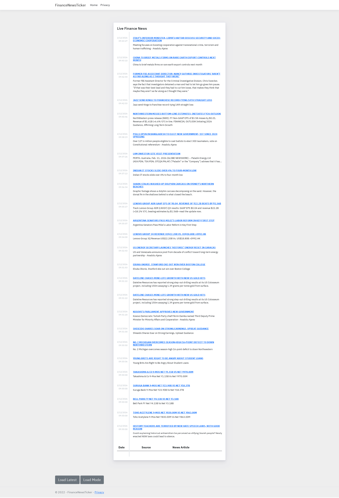

# FinanceNewsTicker
**FinanceNewsTicker** is a web application built with ASP.NET Core (.NET 6) using **Razor Pages** to display financial news.

The application retrieves news from an external financial API and renders them as a list in a server-generated web interface.

### Purpose

To present up-to-date financial news to users in a simple web page format.

### Functionality

* Sends requests to an external financial news API
* Authenticates using a configured API key
* Deserializes the received JSON data
* Displays a list of news articles on Razor Pages

### Configuration

Key settings are stored in `appsettings.json`:

* **API_KEY** — key for accessing the external news service
* **API_URL** — endpoint of the financial news API
* **Logging** — application logging configuration
* **AllowedHosts** — host filtering settings

### Technologies

* **ASP.NET Core (.NET 6)** — web framework
* **Razor Pages** — server-side UI rendering
* **Newtonsoft.Json** — JSON processing
* **External financial news API (apilayer / financelayer)** — data source

### Architectural Role

The project is a lightweight web application focused on fetching and displaying financial news, without additional business or complex backend logic.
